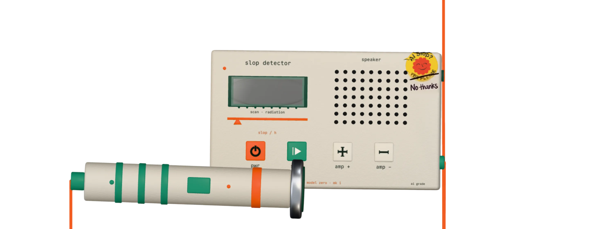

# AI Slop Detector

This repository is WIP and just a public version of an experiment I've been working on.

## How it works (in plain English)

It's a Chrome extension. Every page starts clean. When you want to scan a page, you click the toolbar icon — a tiny 3D Geiger counter slides into the corner. You drag the probe over things on the page — text, images, tweets — and it tells you how AI-slop-y they look. Click the icon again to dismiss it. The next page you visit is clean again until you ask for the device there too.

### The detector

There's no AI model running. Just a list of tells.

For **text**, it counts the things real LLMs and LinkedIn-poisoned humans actually do:

- Buzzwords like *delve, tapestry, navigate, testament to, leverage, paradigm*
- Phrases like *"It's not just X, it's Y"* and *"In today's fast-paced world…"*
- Em-dashes everywhere
- Sentences that are all the same length
- Three sentences in a row starting with the same word
- The brain-rot lexicon (*cooked, mogged, gyatt, no cap, delulu*)

It adds those up into a number between 0 and 1.

For **images**, it checks the URL against a list of known AI-generator hosts (OpenAI, Midjourney, Replicate, Firefly, Leonardo, etc.). On Twitter and LinkedIn, it also reads the post text next to the image and folds that score in too.

For **videos and embeds**, same idea — host fingerprinting plus any title metadata.

That score drives the geiger needle, the clicking sound, and the colour the particles around the element turn:

- 0.0–0.3 → **green** (looks human)
- 0.3–0.7 → **yellow** (suspicious)
- 0.7–1.0 → **red** (probably slop)

### What's actually happening on the page

The whole thing runs locally in your browser. Nothing gets sent to a server. The extension has two parts:

1. A **content script** that mounts on every page — that's the 3D device, the probe tracking your cursor, and the particle overlay around whatever element you're hovering.
2. A **background worker** that just listens for the toolbar icon click and toggles the extension on or off.

The 3D device is built with three.js / react-three-fiber. The particles around the highlighted element are raw WebGL (one draw call, ~150k point sprites tops). The "sticker" on the device body is a flat plane whose vertices are individually raycast onto the body mesh so it conforms to the shape.

### What it's not

Not a real AI classifier. Heuristics catch obvious slop, miss subtle slop, and will need updating as LLMs change. That's the trade — it's something you can ship in a weekend that's right most of the time, instead of nothing while you wait for a real model.

### The paradox

This whole thing was built in a weekend, with Claude. The 3D Geiger counter — body, probe, cable, screen, buttons — was modelled in Blender via Claude's [Blender MCP](https://github.com/ahujasid/blender-mcp), pose-by-pose. The code was written almost entirely in [Claude Code](https://claude.com/claude-code): the WebGL particle system, the heuristic scorer, the Twitter/LinkedIn DOM extraction, the sticker-conformance raycasting, all of it.

So yeah — an AI-slop detector, made by AI. Take that as you will.

## Install it

Once it's live in the Chrome Web Store, the install will be a single click on the listing. Until then, you can sideload it from this repo:

1. Clone the repo and run `bun install` and `bun run build`. That produces `build/chrome-mv3-prod/`.
2. Open `chrome://extensions` in Chrome.
3. Toggle **Developer mode** on (top-right).
4. Click **Load unpacked** and pick the `build/chrome-mv3-prod/` folder.
5. Pin the icon to your toolbar so you can find it. Click it once to enable.

That's it. The device will start sliding into the corner of every page you visit.

## Develop locally

You'll need [Bun](https://bun.sh) installed. Then:

```bash
git clone https://github.com/floriankiem/slob-detector.git
cd slob-detector
bun install
bun run dev
```

`bun run dev` does two things in parallel:

- Compiles the Tailwind CSS + flattens it through Lightning CSS so Plasmo's older bundler can swallow Tailwind v4's output.
- Runs `plasmo dev`, which builds the extension into `build/chrome-mv3-dev/` and rebuilds on every save.

Load `build/chrome-mv3-dev/` in `chrome://extensions` (same flow as installing). Now your edits hot-reload — the content script reinjects on save, and the background worker restarts.

A quick map of where things live:

```
src/
  contents/overlay.tsx      The content script that mounts on every page
  components/               three.js parts: the device, probe, particles, etc.
  components/HighlightOverlay.tsx   The WebGL particle overlay
  components/AIDetector.tsx The 1-second-hover trigger that calls the scorer
  lib/textHeuristic.ts      Text scoring (vocab, phrases, em-dashes, anaphora…)
  lib/imageDetect.ts        Image scoring (host fingerprinting, C2PA TODO)
  lib/socialDetect.ts       Twitter/LinkedIn post-text + video detection
  lib/store.ts              The shared zustand store (powered, reading, …)
  background.ts             Toolbar icon click → toggle storage flag

assets/
  models/MODEL.blend        The Blender source file for the device
  models/geiger.glb         Exported model used at runtime
  audio/                    Geiger-counter clicks
  fonts/                    Commit Mono
  sticker.png, icon.png     Sticker decal + extension icon
```

## Contributing

The fastest contribution that helps is **growing the heuristic**. New AI tells appear constantly. If you spot a phrase, vocab pattern, sentence-shape, or LinkedIn cliché the detector misses, add it.

- **Text patterns** go in `src/lib/textHeuristic.ts`. Drop your regex into `VOCAB_MARKERS` (single words / short phrases) or `PHRASE_MARKERS` (multi-word) or, for structural patterns, add a new check in `scoreText`. Each block has a comment explaining what it matches.
- **AI image hosts** go in `src/lib/imageDetect.ts` → `AI_GENERATOR_HOSTS`.
- **AI video hosts** go in `src/lib/socialDetect.ts` → `AI_VIDEO_HOSTS`.
- **Social platform extraction** (e.g. detection on a new site) goes in `src/lib/socialDetect.ts`. Add a `findThePostText(el)`-style helper next to the Twitter and LinkedIn ones.

Other welcome contributions:

- C2PA manifest reading (there's a TODO in `imageDetect.ts` with the pseudocode).
- Better visuals (sticker placement, particle behaviour, sound design).
- New 3D parts on the device — open `assets/models/MODEL.blend` in Blender, edit, export back to `geiger.glb` (Y up, +Z forward, with materials).

Steps:

1. Fork the repo.
2. Make a branch: `git checkout -b your-improvement`.
3. Run `bun run dev`, hover something, watch it light up red.
4. Commit, push, open a PR.
